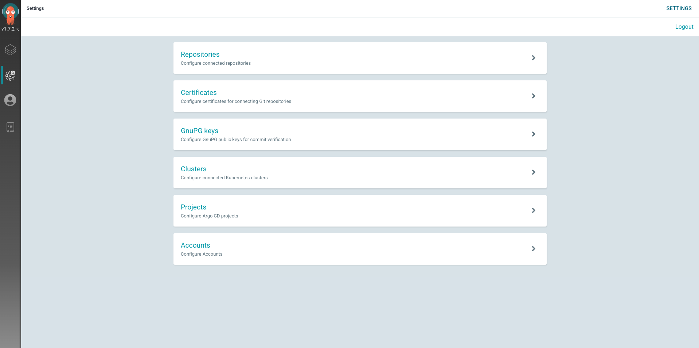
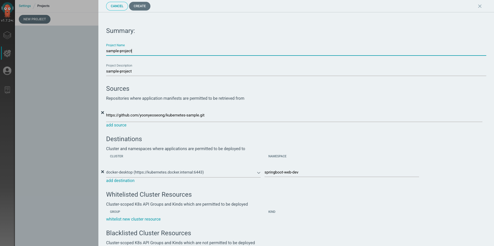
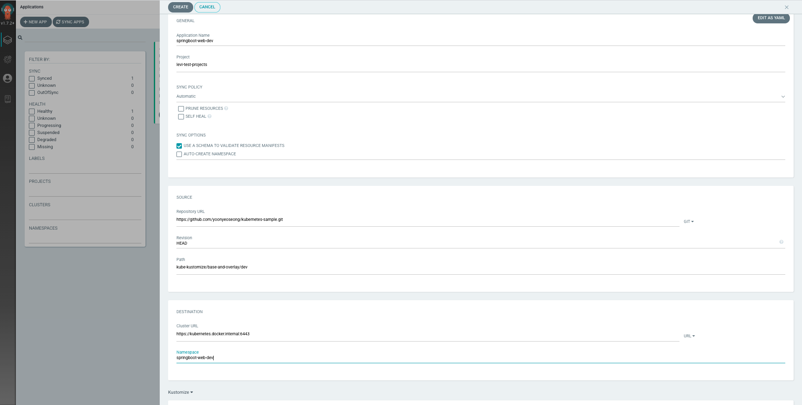
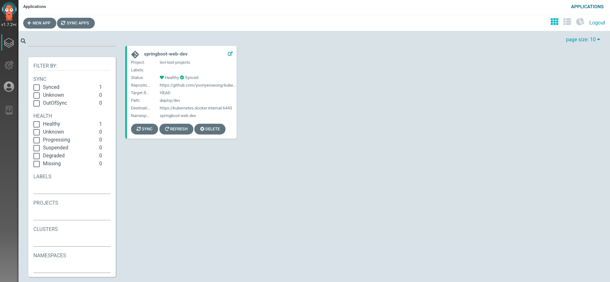
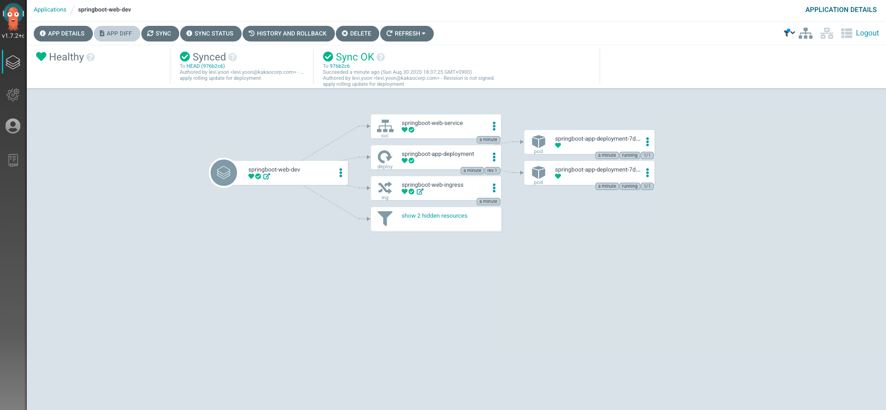

# Argo CD
## Argo CD install
```shell script
> kubectl create namespace argocd
> kubectl apply -n argocd -f ./install.yaml
```

최초 비밀번호는 아래 명령으로 알수 있다.

````shell script
> kubectl get pods -n argocd -l app.kubernetes.io/name=argocd-server -o name | cut -d'/' -f 2
argocd-server-6cbf8f7677-ssskw
````

id/password는 "admin/argocd-server-6cbf8f7677-ssskw" 이 된다. 패스워드를 변경해 사용해보자.
만약 argo CLI 다운로드를 받지 않았다면, 설치하자.

````shell script
> brew tap argoproj/tap
> brew install argoproj/tap/argocd
````

패스워드를 변경해보자.

````shell script
> argocd login <ARGOCD_SERVER>
> argocd login argocd.local.com:32226
  WARNING: server certificate had error: x509: certificate is valid for localhost, argocd-server, argocd-server.argocd, argocd-server.argocd.svc, argocd-server.argocd.svc.cluster.local, not argocd.local.com. Proceed insecurely (y/n)? y
  Username: admin
  Password: argocd-server-6cbf8f7677-ssskw
  'admin' logged in successfully
  Context 'argocd.local.com:32226' updated
> argocd account update-password
  *** Enter current password: argocd-server-6cbf8f7677-ssskw
  *** Enter new password: 변경할 패스워드
  *** Confirm new password: 변경할 패스워드
  Password updated
  Context 'argocd.local.com:32226' updated
````

이제 앱을 배포할 클러스터를 등록해준다(선택사항)

````shell script
> argocd cluster add
ERRO[0000] Choose a context name from:                  
CURRENT  NAME                          CLUSTER                       SERVER
*        docker-desktop                docker-desktop                https://kubernetes.docker.internal:6443
         docker-for-desktop            docker-desktop                https://kubernetes.docker.internal:6443

> argocd cluster add docker-desktop
INFO[0000] ServiceAccount "argocd-manager" created in namespace "kube-system" 
INFO[0000] ClusterRole "argocd-manager-role" created    
INFO[0000] ClusterRoleBinding "argocd-manager-role-binding" created 
Cluster 'https://kubernetes.docker.internal:6443' added
````

## argocd setting


Projects > NEW PROJECT 



argocd는 git을 바탕으로 변경사항을 감지해 배포하기 때문에 github repository 주소가 필요하다.

그리고, 미리 네임스페이스를 생성해준다.



이미지처럼 필요한 정보를 넣어준다. Sync 정책은 automatic으로 잡아주었는데, 실제 깃헙에 변경사항을 자동으로 감지해 Sync를 맞춰준다.
또한 해당 앱 배포를 위해 변경사항을 감지할 디렉토리를 "/dev"로 잡아주었다. 그리고 해당 앱이 배포될 클러스터 정보, 네임스페이스 정보를 넣어주었다.

마지막으로 우리는 쿠버네티스 오브젝트 관리를 kustomize로 하기때문에 가장 마지막에 Kustomize를 선택한다.

CREATE 버튼을 누르면, 우리가 정의한 설정파일 기반으로 앱이 배포된다.


